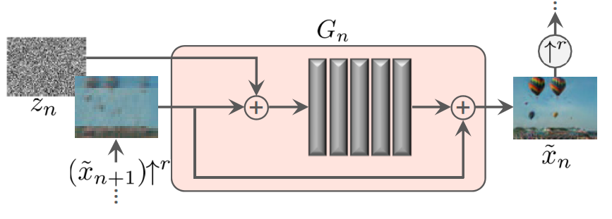

# SinGAN

原仓库：https://github.com/tamarott/SinGAN

代码基于pytoch 1.4实现。本仓库添加中文注释方便学习。

## 文件结构

- Downloads      SinGAN在BSD100数据集上的SR结果，以及研究者使用的数据
- imgs
- Input
- SIFID      一种图像评分，衡量生成图像与真实图像的相似度
  - inception.py
  - sifid_score.py
- SinGAN
  - functions.py
  - imresize.py     来自于另一个库，模仿matlab的imresize函数
  - manipulate.py
  - models.py
  - training.py
- animation.py    从单幅图像生成动画
- config.py     命令行参数处理，opt的来源
- editing.py     图像剪切
- harmonization.py    将剪贴的图像融合进去
- main_train.py     训练代码
- paint2image.py   手绘图转为图像
- random_samples.py    随机产生一些图像样例
- SR.py   超分辨率

## 难点解读

`functions.adjust_scales2image(real_,opt)`

该函数用于求模型的缩放次数、缩放因子，并返回调整尺寸后的输入图像。在opt中同时定义了`scale_factor`缩放因子、`min_size`最小尺寸、`max_size`最大尺寸。其中最小尺寸意味着最粗糙的尺度下，图像长宽不能小于该值；最大尺寸意味着，最精细的尺度下，图像长宽不能大于该值。

该代码的做法是，根据已知条件先求缩放次数，取整，再根据最小尺寸最大尺寸求真正的缩放因子。

> 举例：输入图像为1980 x 1480，缩放因子为0.5，最小尺寸为100，最大尺寸为250
>
> 设缩放次数为s，则对于最小尺寸这一约束条件有
>
> $1480 * 0.5^s>=100$， 即$s = ceil\{log_{0.5}\frac{100}{1480}\}$
>
> 由于$s$进行了取整操作，如果以0.5为缩放因子缩放s次，尺寸必然比最小尺寸大上一些。

# main_train流程概述

## 参数处理

调用`config.py`，生成parser，并添加训练任务需要用到的文件名等参数，存储到opt中

## 图像读取

由于SinGAN不需要数据集，所以不需要写dataloader，直接读取图像即可。这里作者在`functions.read_img()`中用skimage库读取图像为numpy格式，再转为torch里的tensor格式。

## 模型参数设置

`functions.adjust_scales2image`用于根据图像大小，及各层缩放系数，来求出最合适的缩放系数与模型层数。

## 模型训练

### 真实图像金字塔

需要根据各层缩放系数，求出各层的图像尺寸，并将真实图像一 一缩放为相应尺寸。

## 生成器模型

生成器的输入为噪声与上层生成图像的升采样构成。对于最底层，上层生成图像为全0.

下图中，左侧的加号其实省略了“对zn进行了sigma的加权”，这个sigma是x_(n+1)与当前层真实图像的RMSE，作为对噪声的估计值。

下图中，右侧的加号则忽略了x(n+1)与卷积层输出长宽的不一致。代码中直接在x(n+1)截取出合适大小的区域，与卷积层输出相加

## 训练细节

需要注意的要点有

1. 每放大4次（即经过4层），便使生成网络卷积层的通道数提高两倍。但生成器网络的输入输出层都仍要是正常图像，即通道数为3

2. 为保证经过生成器网络后的图像尺寸不变，记得设置好padding

3. 它的训练逻辑是

   1. 对从底层向上进行训练，训练好一层才会开始训练下一层
   2. 对同一层的生成模型跟判别模型训练`opt.iter_num`个epoch
   3. 在每个epoch中，分别对生成模型跟判别模型更新3次。这种做法可以加快模型收敛

4. 判别器的损失函数为errD = errD_fake - errD_real + gradient_penalty

   1. errD_real 与 errD_fake是判别器在不同输入情况下，输出图像的均值，作为真实程度的概率估计，值越大则越真
   2. gradient_penalty则是对模型梯度的约束，可参考论文

5. 生成器的损失函数为errG = -errD_fake + alpha * rec_loss

   1. rec_loss为生成图像与真实图像的L2距离
   2. 计算rec_loss时，只需要在那3次更新内保证输入噪声不变即可。对于更高层级，则无输入噪声

   
